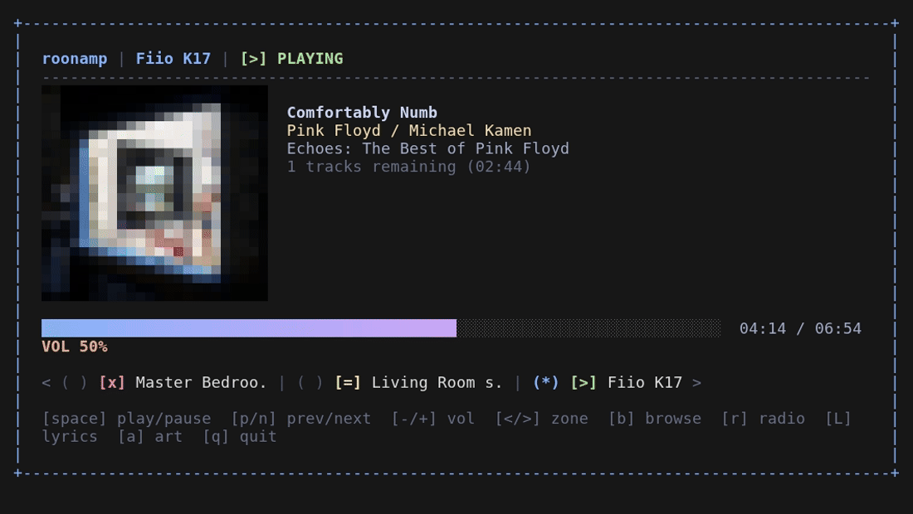

# roonamp

A terminal music controller for [Roon](https://roon.app), built with Go and the [Charm](https://charm.sh) ecosystem.

Connects directly to your Roon Core over WebSocket using the native MOO protocol. No Node.js bridge, no HTTP proxy -- a single static binary.



*Player with album art, library browser with fuzzy filtering, global search, and synced lyrics -- recorded with [VHS](https://github.com/charmbracelet/vhs) (`vhs demo.tape`).*

## Features

- Now Playing view with track, artist, album, and album art
- Animated progress bar with smooth transitions
- Transport controls: play/pause, next, previous, stop
- Volume control (shows on change, auto-hides after 5 seconds)
- Multiple zone support with quick switching
- Library browser with vim-style navigation (`h`/`j`/`k`/`l`)
- fzf-style fuzzy filtering in the browser (`/`)
- Global library search across artists, albums, and tracks (`s`)
- Album art rendered directly in the terminal
- Queue info (remaining tracks and time)
- Preferences persisted across sessions (selected zone, album art toggle)

## Requirements

- [Go](https://go.dev/dl/) 1.26 or later
- A running [Roon Core](https://roon.app) on your network
- A terminal with true color support (most modern terminals)

## Installation

### From source

```bash
git clone https://github.com/brokenrubik/roonamp.git
cd roonamp
go build -o roonamp .
```

The binary is at `./roonamp`. Move it to your PATH if desired:

```bash
sudo mv roonamp /usr/local/bin/
```

### Go install

```bash
go install github.com/brokenrubik/roonamp@latest
```

## Usage

With no arguments, roonamp finds your Roon Core automatically:

```bash
roonamp
```

It first retries the last address it connected to (cached in `~/.config/roonamp/server`), and if that fails -- e.g. your router handed the Core a new IP -- it discovers the Core on the local network via SOOD (UDP multicast). You can still pin a specific Core manually:

### With flags

```bash
roonamp -host 192.168.1.50 -port 9330
```

### With environment variables

```bash
export ROON_HOST=192.168.1.50
export ROON_PORT=9330
roonamp
```

Flags take priority over environment variables.

### Finding your Roon Core address

The HTTP port varies by installation (commonly 9100, 9150, 9200, 9330). You can find it in:

- Roon Settings -> About (look for the HTTP port)
- Your router's device list for the Roon Core IP
- Network scanning: `nmap -p 9100-9400 192.168.1.0/24`

### First-time authorization

On the first connection, Roon will ask you to authorize the extension:

1. Open Roon on your desktop/tablet
2. Go to **Settings -> Extensions**
3. Find **roonamp** and click **Enable**

The auth token is saved to `~/.config/roonamp/token` for future connections.

## Keybindings

### Player view

| Key | Action |
|-----|--------|
| `space` | Play / Pause |
| `n` | Next track |
| `p` | Previous track |
| `s` | Stop |
| `+` / `=` | Volume up |
| `-` | Volume down |
| `<` / `>` | Switch zone |
| `a` | Toggle album art |
| `b` | Open library browser |
| `q` | Quit |
| `ctrl+c` | Force quit |

### Browser view

| Key | Action |
|-----|--------|
| `j` / `k` | Navigate up / down |
| `l` / `enter` / `right` | Open / drill into |
| `h` / `backspace` / `left` | Go back one level |
| `/` | Fuzzy filter (fzf-style) on the current list |
| `s` | Global library search (artists, albums, tracks) |
| `esc` / `q` | Return to player |

### Filter mode (in browser)

| Key | Action |
|-----|--------|
| _type_ | Fuzzy search on title and subtitle |
| `enter` | Accept filter |
| `esc` | Clear filter |
| `backspace` | Delete character |

### Search mode (in browser)

| Key | Action |
|-----|--------|
| _type_ | Build the search query |
| `enter` | Run the search via Roon's browse API |
| `esc` | Cancel without searching |
| `backspace` | Delete character |

## Configuration

roonamp stores its data in `~/.config/roonamp/` (or `$XDG_CONFIG_HOME/roonamp/`):

| File | Purpose |
|------|---------|
| `token` | Roon auth token (auto-saved on first auth) |
| `zone` | Last selected zone ID |
| `prefs` | UI preferences (album art on/off) |
| `zones` | Optional zone whitelist (see below) |

No manual configuration is needed. All files are created automatically.

### Zone whitelist

If your Core exposes more zones than you actually use, create `~/.config/roonamp/zones` with one entry per line to only show those zones in the switcher:

```
# case-insensitive substring of the zone's display name, or an exact zone ID
fiio
```

Blank lines and `#` comments are ignored. If no entry matches a live zone, all zones are shown (so a typo never leaves you with an empty zone list). Delete the file to show all zones again.

## How it works

roonamp talks to the Core through [roon-go](https://github.com/BRJoaquin/roon-go), a Go library that implements two of Roon's proprietary protocols:

- **MOO** (over WebSocket) -- message framing protocol for all communication with Roon Core. HTTP-like format with `MOO/1` prefix, request IDs, and JSON bodies.
- **SOOD** (UDP multicast) -- discovery protocol for finding Roon Cores on the network. Used automatically when no address is given and the cached one fails.

The app registers as a Roon extension, subscribes to zone updates, and provides real-time transport control. The library browser maintains a client-side navigation stack for instant back-navigation without additional API calls.

Want to drive Roon from a language model? [roon-mcp](https://github.com/BRJoaquin/roon-mcp) is an MCP server built on the same library.

## Limitations

- Roon's extension API does not expose signal path information (sample rate, bit depth, codec). Your DAC reads this from the USB audio stream directly.
- Album art quality depends on terminal capabilities and font size.
- SOOD auto-discovery requires the Core to be on the same L2 network (multicast/broadcast reachable). Across VLANs or VPNs, use `-host` and `-port`.

## Built with

- [Bubble Tea](https://github.com/charmbracelet/bubbletea) -- TUI framework
- [Lip Gloss](https://github.com/charmbracelet/lipgloss) -- Styling
- [Bubbles](https://github.com/charmbracelet/bubbles) -- Progress bar and spring animations
- [sahilm/fuzzy](https://github.com/sahilm/fuzzy) -- fzf-style fuzzy matching
- [roon-go](https://github.com/BRJoaquin/roon-go) -- Roon MOO/SOOD client and browse helpers
- [Gorilla WebSocket](https://github.com/gorilla/websocket) -- WebSocket client

## License

MIT
